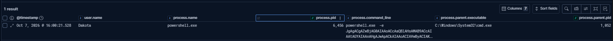
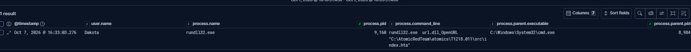
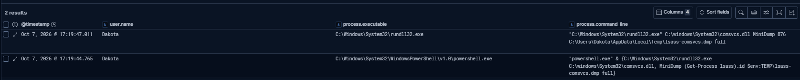
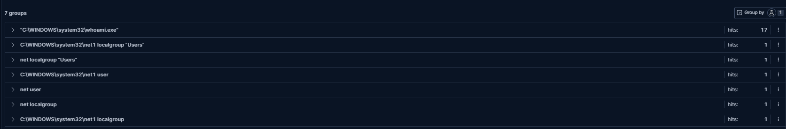
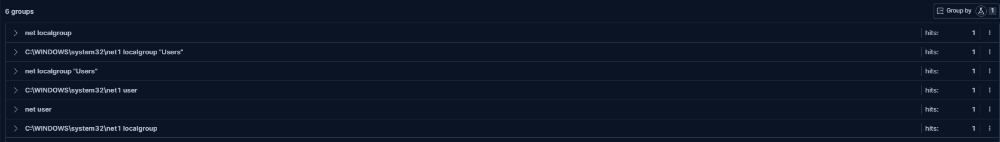

# detection-as-code

A Git repository of [Sigma](https://github.com/SigmaHQ/sigma) detection rules that validate themselves. Each rule is written once in vendor-neutral Sigma, automatically converted to three SIEM query languages by CI, and proven against real attack telemetry using [Atomic Red Team](https://github.com/redcanaryco/atomic-red-team) fired at a live Windows VM shipping logs into self-hosted Elastic.

**What this demonstrates:** Sigma authoring · multi-SIEM rule conversion · CI-validated detection-as-code · Atomic Red Team validation.

---

## How it works

```
                   write once
   Sigma rule  ────────────────►  rules/*.yml
      │
      │  git push
      ▼
  GitHub Actions (CI)
      │  sigma check   ── rejects malformed rules
      │  sigma convert ── one rule → three languages
      ▼
   ES|QL  ·  SPL  ·  KQL        (downloadable build artifact)

   Validation loop (per rule):
   reason about the technique → write the rule blind →
   fire the Atomic test at an isolated Windows VM →
   confirm the detection fires in Elastic
```

A rule is written **before** its attack is run, so it targets the *technique*, not one specific command.

---

## Architecture

| Component | Role |
| --- | --- |
| Self-hosted Elastic + Kibana (Docker Compose, pinned version) | SIEM: stores telemetry, runs queries |
| Fleet Server + Elastic Agent | Managed log collection from the endpoint |
| Windows 11 VM + Sysmon (sysmon-modular) | Detection target; generates rich process telemetry |
| Atomic Red Team | Fires real attack techniques to validate rules |
| sigma-cli + pySigma backends | Converts Sigma → ES\|QL / SPL / KQL |
| GitHub Actions | Validates and converts every rule on push |

The Windows VM runs with **NAT disabled** during attack simulation, isolated to a host-only network so atomics can never reach anything but the lab. Every atomic is run against a VM snapshot that is rolled back afterward.

---

## Detection coverage

Five rules spanning five MITRE ATT&CK tactics:

| Rule | Technique | Tactic | What it detects |
| --- | --- | --- | --- |
| `win_schtasks_creation` | T1053.005 | Persistence | Scheduled task creation via `schtasks /create` |
| `win_powershell_encoded` | T1059.001 | Execution / Defense Evasion | PowerShell encoded commands (`-enc`, `-e`, …) |
| `win_rundll32_abuse` | T1218.011 | Defense Evasion | Rundll32 proxy execution (JavaScript, `url.dll`, …) |
| `win_lsass_dump` | T1003.001 | Credential Access | LSASS memory dumping (comsvcs, procdump, …) |
| `win_account_discovery` | T1087.001 / T1033 | Discovery | Local account & system enumeration |

---

## Validation results

Every rule was written blind, then validated by firing its Atomic Red Team test and confirming the detection fired in Elastic. All times UTC.

| Technique | Atomic # | Rule | Fired? |
| --- | --- | --- | --- |
| T1053.005 Scheduled Task | 1 | `win_schtasks_creation` | ✅ Caught both tasks created |
| T1059.001 Encoded PowerShell | 17 | `win_powershell_encoded` | ✅ Caught `-e <base64>` |
| T1218.011 Rundll32 abuse | 8 | `win_rundll32_abuse` | ✅ A control query found a missed command; rule fixed and re-tested |
| T1003.001 LSASS dump | 2 | `win_lsass_dump` | ✅ Caught dumper + launcher |
| T1087.001 / T1033 Discovery | 8 | `win_account_discovery` | ✅ Then tuned for false positives (below) |

**T1059.001 — encoded PowerShell detected in Elastic:**


**T1218.011 — rundll32 proxy execution detected:**


**T1003.001 — LSASS dump detected (both the comsvcs dumper and its PowerShell launcher):**


---

## The CI pipeline

On every push touching `rules/`, GitHub Actions:

1. Installs `sigma-cli` and the Elasticsearch / Splunk / Kusto / Sysmon backends
2. Runs `sigma check rules/` — **fails the build on any malformed rule**
3. Converts every rule to ES\|QL, SPL, and KQL
4. Uploads the converted queries as a downloadable artifact

The guardrail is the point: a rule that doesn't parse never reaches conversion. This was verified by pushing a deliberately broken rule (a condition referencing an undefined selection) and confirming CI failed at the `sigma check` step before conversion, then went green once the rule was removed.

---

## One rule, three languages

The same Sigma rule (`win_schtasks_creation`), converted automatically by CI:

**Sigma (source)**
```yaml
detection:
    selection:
        Image|endswith: '\schtasks.exe'
        CommandLine|contains: '/create'
    condition: selection
```

**ES|QL (Elastic)**
```
from * | where ends_with(process.executable.caseless, "\\schtasks.exe")
         and process.command_line like "*/create*"
```

**SPL (Splunk)**
```
EventID=1 Image="*\\schtasks.exe" CommandLine="*/create*"
```

**KQL (Microsoft Defender)**
```
DeviceProcessEvents
| where FolderPath endswith "\\schtasks.exe" and ProcessCommandLine contains "/create"
```

---

## Tuning false positives

Rule 5 (`win_account_discovery`) was chosen as a deliberately noisy detection to demonstrate tuning. Baseline over 24h: `whoami.exe` fired **17 times**, almost all benign automation, while the actual `net user` / `net localgroup` enumeration fired once each.



**Fix:** require a discovery-relevant argument (`/priv`, `/all`, `/groups`, `/user`) on `whoami` instead of matching the bare process.

**Result:** `whoami` false positives cut from **17 → 0** while all `net`-based discovery detection was retained.



**Accepted tradeoff:** a bare `whoami` with no arguments no longer alerts. That's the right call — it carries almost no signal and runs constantly via automation, while `whoami /priv` and `/all` (the attacker-interesting forms) are still caught.

---

## Repository layout

```
detection-as-code/
├── rules/                     # Sigma rules (source of truth)
├── converted/                 # Example converted output (esql/spl/kql)
├── elastic/                   # Docker Compose stack + config
├── .github/workflows/         # CI: validate + convert
├── docs/images/               # Screenshots used in this README
└── README.md
```

---

## Run it yourself

**Prerequisites:** Docker Desktop, a Windows VM with Sysmon + Elastic Agent, Python 3.

```bash
# 1. Bring up Elastic + Kibana
cd elastic
cp .env.example .env          # fill in passwords + an encryption key
docker compose up -d          # Kibana at http://localhost:5601

# 2. Set up the rule toolchain (in a virtualenv)
python -m venv .venv
.venv/Scripts/Activate.ps1    # Windows
pip install sigma-cli
sigma plugin install elasticsearch splunk kusto sysmon

# 3. Convert a rule locally
sigma convert -t esql -p ecs_windows --disable-pipeline-check rules/win_schtasks_creation.yml

# 4. Or just push — CI validates and converts every rule automatically
git add rules/ && git commit -m "add rule" && git push
```

---

## Notes & honest limitations

- **Lab-only security tradeoffs:** Elasticsearch runs over HTTP and Fleet Server uses a self-signed certificate. Production would use CA-signed TLS throughout.
- **Command-line vs. handle-based detection:** `win_lsass_dump` matches dumper command lines (Sysmon Event ID 1). A stronger version would detect LSASS handle access (Event ID 10), which this Sysmon config does not currently log.
- **No live deployment yet:** validated rules are converted but not auto-loaded into Elastic as live detection rules, so the Sigma source and the running SIEM query can drift. Closing that gap — a deploy step that pushes validated rules to Elastic's detection-rule API.
